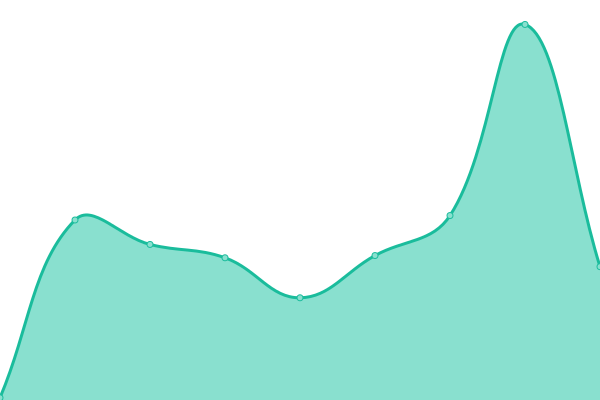
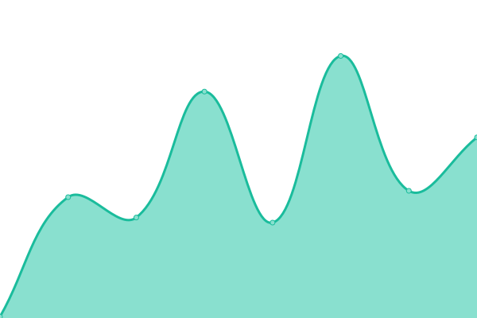
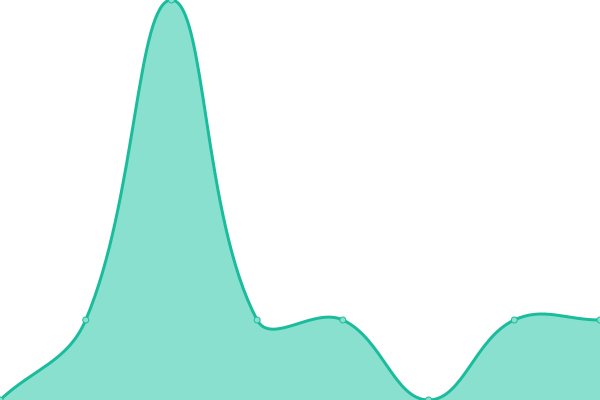

# [📈 Live Status](https://status.spacespacespacetime.dev): <!--live status--> **🟧 Partial outage**

This repository contains the open-source uptime monitor and status page for [Upptime](https://upptime.js.org), powered by [Upptime](https://github.com/upptime/upptime).

With [Upptime](https://upptime.js.org), you can get your own unlimited and free uptime monitor and status page, powered entirely by a GitHub repository. We use [Issues](https://github.com/upptime/upptime/issues) as incident reports, [Actions](https://github.com/adamus1red/status-checks/actions) as uptime monitors, and [Pages](https://status.spacespacespacetime.dev) for the status page.

<!--start: status pages-->
<!-- This summary is generated by Upptime (https://github.com/upptime/upptime) -->
<!-- Do not edit this manually, your changes will be overwritten -->
<!-- prettier-ignore -->
| URL | Status | History | Response Time | Uptime |
| --- | ------ | ------- | ------------- | ------ |
|  [Octal](https://octal.xyz) | 🟥 Down | [octal.yml](https://github.com/adamus1red/status-checks/commits/HEAD/history/octal.yml) | 

 104ms
     
 | 

<a href="https://status.spacespacespacetime.dev/history/octal">0.00%</a>
    

|  [Huginn](https://huginn.octal.xyz/) | 🟩 Up | [huginn.yml](https://github.com/adamus1red/status-checks/commits/HEAD/history/huginn.yml) | 

 503ms
     
 | 

<a href="https://status.spacespacespacetime.dev/history/huginn">100.00%</a>
    

|  [Health Checker](https://health.octal.xyz/) | 🟩 Up | [health-checker.yml](https://github.com/adamus1red/status-checks/commits/HEAD/history/health-checker.yml) | 

 998ms
     
 | 

<a href="https://status.spacespacespacetime.dev/history/health-checker">100.00%</a>
    

|  [Status Page](https://status.spacespacespacetime.dev/) | 🟥 Down | [status-page.yml](https://github.com/adamus1red/status-checks/commits/HEAD/history/status-page.yml) | 

 0ms
     
 | 

<a href="https://status.spacespacespacetime.dev/history/status-page">0.00%</a>
    

|  IRC | 🟩 Up | [irc.yml](https://github.com/adamus1red/status-checks/commits/HEAD/history/irc.yml) | 

 125ms
     
 | 

<a href="https://status.spacespacespacetime.dev/history/irc">100.00%</a>
    

|  IRC SSL | 🟩 Up | [irc-ssl.yml](https://github.com/adamus1red/status-checks/commits/HEAD/history/irc-ssl.yml) | 

 135ms
     
 | 

<a href="https://status.spacespacespacetime.dev/history/irc-ssl">100.00%</a>
    

|  ZNC | 🟩 Up | [znc.yml](https://github.com/adamus1red/status-checks/commits/HEAD/history/znc.yml) | 

 118ms
     
 | 

<a href="https://status.spacespacespacetime.dev/history/znc">100.00%</a>
    

|  [Google DNS 1](8.8.4.4) | 🟩 Up | [google-dns-1.yml](https://github.com/adamus1red/status-checks/commits/HEAD/history/google-dns-1.yml) | 

 6ms
     
 | 

<a href="https://status.spacespacespacetime.dev/history/google-dns-1">100.00%</a>
    

|  [Google DNS 2](8.8.8.8) | 🟩 Up | [google-dns-2.yml](https://github.com/adamus1red/status-checks/commits/HEAD/history/google-dns-2.yml) | 

 7ms
     
 | 

<a href="https://status.spacespacespacetime.dev/history/google-dns-2">100.00%</a>
    

<!--end: status pages-->

[**Visit our status website →**](https://status.spacespacespacetime.dev)

## 📄 License

- Powered by: [Upptime](https://github.com/upptime/upptime)
- Code: [MIT](./LICENSE) © [Upptime](https://upptime.js.org)
- Data in the `./history` directory: [Open Database License](https://opendatacommons.org/licenses/odbl/1-0/)
